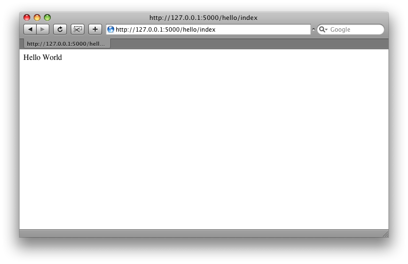
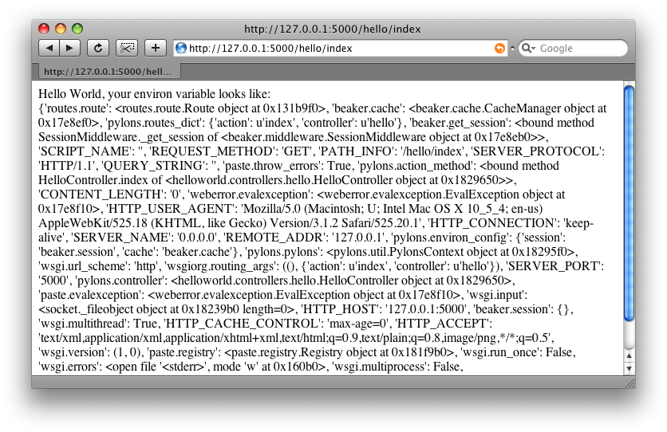

.. _getting_started:

===============
快速入门
===============

译者：alswl_

.. _alswl: http://log4d.com/

这章内容打算告诉你如何最简安装和运行 Pylons，并介绍一下工程概况。
整个过程中会提供一些链接来鼓励用户自行探索 Pylons 的各个方面。

************
安装需求
************

* Python 2.4 以上（包括2.4，但是目前还不支持 Python 3）

.. _installing_pylons:

**********
安装
**********

为了避免和系统自带的 Python 库混淆，Pylons 提供了一个初始化脚本来配置一个「虚拟」的
Python 环境。Pylons 一会就会被安装在这个虚拟环境中。

.. admonition:: By the Way
    
    :term:`virtualenv` 是用来创建独立 Python 环境的工具。它可以避免在使用 
    :term:`easy_install` 时候将一大堆包安装到系统级 Python 环境中。

    它的另一个优点是不需要管理员权限，因为它将所有模块安装在用户期望的目录里。
    当在虚拟空间和其他没有管理员权限的时候，它让安装 Pylons 变得可能。

1. 下载 `go-pylons.py <http://www.pylonshq.com/download/1.0/go-pylons.py>`_ 脚本。
2. 运行脚本，并指定一个目录用来安装虚拟环境：
    
    .. code-block:: bash
        
        $ python go-pylons.py mydevenv

.. admonition:: Tip
    
    在 unix 系统上，通过 curl 我们可以将上述两步并作一步：
    
    .. code-block:: bash
    
        $ curl http://pylonshq.com/download/1.0/go-pylons.py | python - mydevenv
    
    如果不想从系统 Python 中获取现有第三方包，使用 --no-site-packages 这个参数：
    
    .. code-block:: bash
    
        $ python go-pylons.py --no-site-packages mydevenv
    
    | **工作原理**
    
    ``go-pylons.py`` 比 :term:`virtualenv` 稍微多一点点初始化步骤，运行
    ``easy_install Pylons==1.0``。你也可以手动获取 ``virtualenv.py`` ，然后安装
    Pylons，效果是一样的。
    
    .. code-block:: bash
        
        curl -O http://bitbucket.org/ianb/virtualenv/raw/8dd7663d9811/virtualenv.py
        python virtualenv.py mydevenv
        mydevenv/bin/easy_install Pylons==1.0
    

以上操作会安装一个 virtualenv 和 Pylons。
    
激活虚拟环境：

.. code-block:: bash

    $ source mydevenv/bin/activate

在 Windows 上这样激活：

.. code-block:: text
    
    > mydevenv\Scripts\activate.bat

.. note::
    
    如果你获得一个错误信息：
        
        ImportError: No module named _md5
    
    一般是由于你的 Python 在安装时候没有 Pylons 必要的标准库。Debian 系的系统
    容易遇到这个问题。请确保已经安装了 ``python-dev`` 和 ``python-hashlib`` 。

从源码安装 Pylons
=====================================

需要使用 `Mercurial <http://www.selenic.com/mercurial/wiki/>`_
来从 Pylons 源地址获取最新开发版。
`Mercurial packages <http://www.selenic.com/mercurial/wiki/index.cgi/BinaryPackages>`_
在 Windows, MacOSX 和其他操作系统都有对应的版本。

签出最新代码：

.. code-block:: bash 

    $ hg clone http://bitbucket.org/bbangert/pylons/

在 ``Pylons`` 目录中给 setuptools 指定安装版本：

.. code-block:: bash 

    $ cd pylons 
    $ python setup.py develop 

好了，当前的 Pylons 版本已经是刚才安装目录下的了，版本变化将反映在运行的 Pylons
应用中。

*************************
创建 Pylons 项目
*************************

通过一下明来来创建一个名为 ``helloworld`` 的新项目：

.. code-block:: bash

    $ paster create -t pylons helloworld

.. note:: 
    
    Windows 用户需要参考 :ref:`windows_notes` 设定 ``PATH`` ，另外他们需要使用 ``paster``
    的绝对路径（包括环境路径里面的 bin 目录）

这条命令运行时候会有提示要确认两个问题：

1. 使用什么模板系统
2. 是否需要使用 :term: `SQLAlchemy` 支持

直接按回车键则接受默认设置（Mako 模板系统，不使用 :term:`SQLAlchemy` ）。

下面是生成的目录结构，里面有些链接可以提供更多信息：

- helloworld
    - MANIFEST.in
    - README.txt
    - development.ini - :ref:`run-config`
    - docs
    - ez_setup.py
    - helloworld (See the nested :ref:`helloworld directory <helloworld_dir>`)
    - helloworld.egg-info
    - setup.cfg
    - setup.py - :ref:`setup-config`
    - test.ini

.. _helloworld_dir:

``helloworld directory`` 目录里面大概是这样：

- helloworld
    - __init__.py
    - config
        - environment.py - :ref:`environment-config`
        - middleware.py - :ref:`middleware-config`
        - routing.py - :ref:`url-config`
    - controllers - :ref:`controllers`
    - lib
        - app_globals.py - :term:`app_globals`
        - base.py
        - helpers.py - :ref:`helpers`
    - model - :ref:`models`
    - public
    - templates - :ref:`templates`
    - tests - :ref:`testing`
    - websetup.py - :ref:`run-config`

***********************
启动应用
***********************

启动 Web 应用：

.. code-block:: bash

    $ cd helloworld
    $ paster serve --reload development.ini
    
这个命令从 `development.ini` 中获取服务器配置信息并运行 Pylons 应用。

.. note::
    
    ``--reload`` 可以让服务器在 Python 文件或者 :file:`development.ini`
    改变之后自动重新加载。使用 :command:`Ctrl+c`
    或者其他平台类似的按键来停止服务器。
    
    只要 development.ini 文件被指定了，这个 paster serve 命令可以在任何地方执行。
    在开发过程中，一般在工程根目录下运行。

当服务器在运行时候，访问 http://127.0.0.1:5000/ 就可以看到欢迎页面了。

***********
Hello World
***********

我们将在工程中创建一个 :term:`controller` 控制器来响应请求。

.. code-block:: bash

    $ paster controller hello

打开我们创建的 :file:`helloworld/controllers/hello.py` 模块。
默认创建的控制器将仅仅返回字符串 'Hello World'。

.. code-block:: python

    import logging

    from pylons import request, response, session, tmpl_context as c, url
    from pylons.controllers.util import abort, redirect

    from helloworld.lib.base import BaseController, render

    log = logging.getLogger(__name__)
    
    class HelloController(BaseController):

        def index(self):
            # Return a rendered template
            #return render('/hello.mako')
            # or, Return a response
            return 'Hello World'

在这个模块的顶部，一些通用模块已经自动被引入了。

打开 http://127.0.0.1:5000/hello/index ，我们将看到一个简短的字符串 "Hello World"
（需要启动服务器）。

.. admonition:: Tip
    
    :ref:`url-config` 描述了 URL 链接和响应方法之间的关系。

添加一个模板来返回一些 :term:`environ` 中的信息。

首先，仿照下文在 :file:`templates` 目录下创建文件 :file:`hello.mako` 。

.. code-block:: mako

    Hello World, the environ variable looks like:  
    
    ${request.environ}

模板中的变量 :term:`request` 通常用来获取当前请求的信息。
:ref:`Template globals <template-globals>` 将列出所有模板中可用的 Pylons 变量。

接下来，按照下面代码更新 :file:`controllers/hello.py` 中的  index 方法。

.. code-block:: python

    class HelloController(BaseController):

        def index(self):
            return render('/hello.mako')

刷新页面，你将看到如下图这样的信息。

